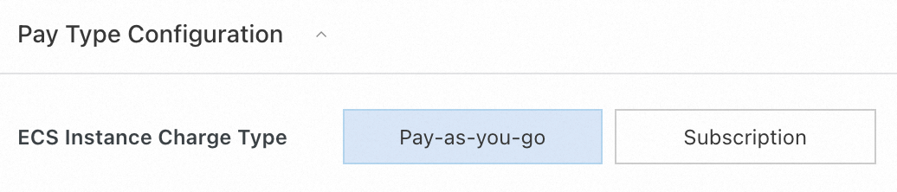
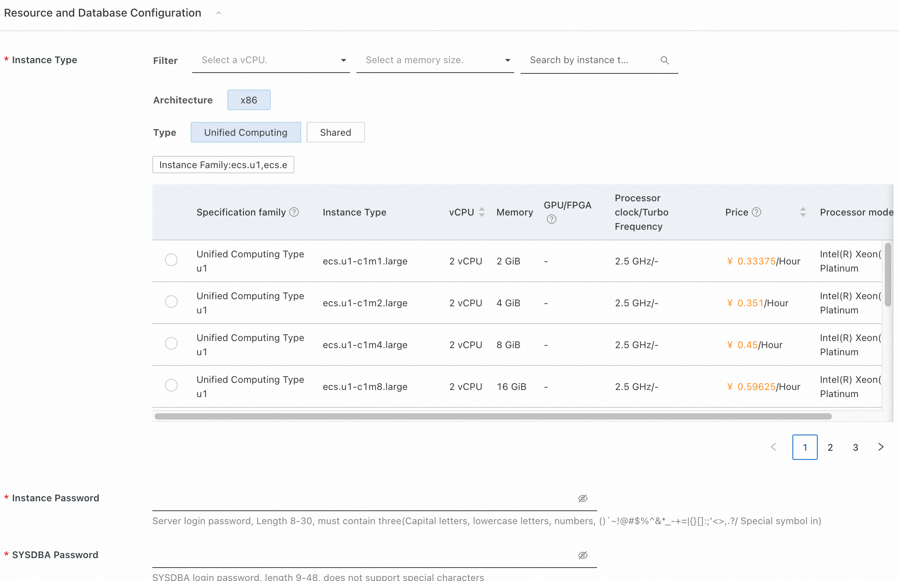
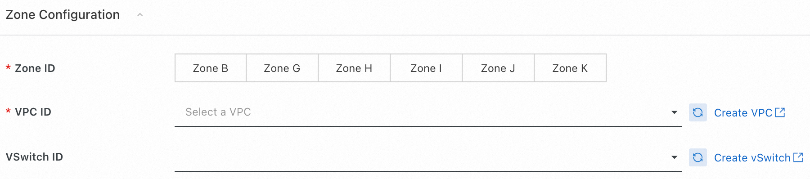
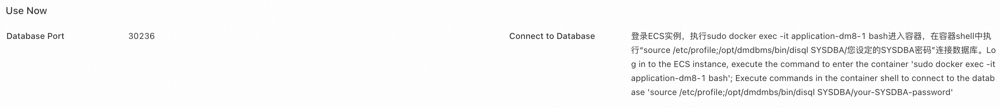

# Rapid deployment of Dameng Database DM8 Community Edition by Computing Nest

>**Disclaimer * *: This service is provided by a third party, and we strive to ensure its security, accuracy, and reliability. However, we cannot guarantee that it is completely free from malfunctions, interruptions, errors, or attacks. Therefore, the company hereby declares that it makes no representations, warranties, or commitments regarding the content, accuracy, completeness, reliability, applicability, or timeliness of this service, and shall not be liable for any direct or indirect losses or damages arising from your use of this service; We assume no responsibility for the content, accuracy, completeness, reliability, applicability, or timeliness of third-party websites, applications, products, and services that you access through this service. You shall be solely responsible for the risks and liabilities arising from the consequences of your use; We shall not be liable for any losses or damages arising from your use of this service, including but not limited to direct losses, indirect losses, loss of profits, loss of goodwill, loss of data, or other economic losses, even if we have been informed in advance of the possibility of such losses or damages; We reserve the right to modify this statement from time to time, so please check this statement regularly before using this service. If you have any questions or concerns about this statement or service, please contact us.

## Overview
A large-scale general-purpose relational database that is 100% independently developed, with ultimate compatibility, high availability, high reliability, and high security. It is a database product that solves the bottleneck pain points in China's basic software field. Currently, it has helped 50+key industries achieve core system upgrades.

Product official website address: [Dameng Database Management System DM8](https://eco.dameng.com/info/products/dm8)


## Preconditions
Deploying the DM8 Community Edition service instance of Dameng Database requires accessing and creating some Alibaba Cloud resources. Therefore, your account needs to have access to the following resources: (This permission needs to be added only when your account is a RAM account)

|<font style="color: rgb (51, 51, 51);">Permission Policy Name</font>|<font style="color: rgb (51, 51, 51);">Remarks</font>|
| --- | --- |
|<font style="color: rgb (51, 51, 51);">AliyunECFullAccess</font>|<font style="color: rgb (51, 51, 51);">Manage permissions for Cloud Server Services (ECS)</font>|
|<font style="color: rgb (51, 51, 51);">AliyunVPCFullAccess</font>|<font style="color: rgb (51, 51, 51);">Manage VPC permissions</font>|
|<font style="color: rgb (51, 51, 51);">AliyunRosFullAccess</font>|<font style="color: rgb (51, 51, 51);">Manage permissions for Resource Organization Services (ROS)</font>|
|<font style="color: rgb (51, 51, 51);">AliyunComputerNestUserFullAccess</font>|<font style="color: rgb (51, 51, 51);">Manage user side permissions for Compute Nest service</font>|


## Billing Instructions
The cost of deploying Dameng Database DM8 Community Edition in the computing nest mainly involves:

- Selected vCPU and Memory Specifications
- System disk type and capacity
- Public network bandwidth


## Deployment Architecture
This service is deployed on a single ECS instance, with the following architecture:


By default, public access to databases is not supported to ensure security.

## Parameter Description
|<font style="color: rgb (51, 51, 51);">Parameter group</font>|<font style="color: rgb (51, 51, 51);">Parameter item</font>|<font style="color: rgb (51, 51, 51);">Description</font>|
| --- | --- | --- |
|<font style="color: rgb (51, 51, 51);">Service instance</font>|<font style="color: rgb (51, 51, 51);">Service instance name</font>|<font style="color: rgb (51, 51, 51);">The length should not exceed 64 characters and must start with an English letter. It can include numbers, English letters, dashes (-), and underscores (_)</font>|
||<font style="color: rgb (51, 51, 51);">Region</font>|<font style="color: rgb (51, 51, 51);">Region of service instance deployment</font>|
||<font style="color: rgb (51, 51, 51);">Payment type</font>|<font style="color: rgb (51, 51, 51);">Resource billing types: pay as you go and monthly subscription</font>|
|<font style="color: rgb (51, 51, 51);">Resource and database configuration</font>|<font style="color: rgb (51, 51, 51);">Instance type</font>|<font style="color: rgb (51, 51, 51);">Instance specifications that can be used under the availability zone</font>|
||<font style="color: rgb (51, 51, 51);">Instance password</font>|<font style="color: rgb (51, 51, 51);">Length 8-30, must contain three items (uppercase letters, lowercase letters, numbers, () `~! @ # $%^&*-+=| {}[]:;'<>,.?/  Special symbols in</font>|
||<font style="color: rgb (51, 51, 51);">SYSDBA password</font>|<font style="color: rgb (51, 51, 51);">SYSDBA login password, length 9-48, does not support special characters as passwords</font>|
|<font style="color: rgb (51, 51, 51);">Zone Configuration</font>|<font style="color: rgb (51, 51, 51);">Zone</font>|<font style="color: rgb (51, 51, 51);">Zone where ECS instance is located</font>|
||<font style="color: rgb (51, 51, 51);">VPC ID</font>|<font style="color: rgb (51, 51, 51);">VPC where the resource is located</font>|
||<font style="color: rgb (51, 51, 51);">Switch ID</font>|<font style="color: rgb (51, 51, 51);">Switch where the resource is located</font>|

## Deployment process
1. Access the Computing Nest Dameng Database DM8 Community Edition [Deployment Link](https://computenest.console.aliyun.com/service/instance/create/cn-hangzhou?type=user&ServiceName=达梦数据库DM8社区版). Fill in the deployment parameters according to the prompts.
2. Select payment type

3. Fill in the instance parameters and database SYSDBA password

4. Fill in the availability zone and network parameters and click "Next: Confirm Order"
   
5. After confirming the deployment parameters and viewing the estimated price, click "Create Now" and wait for the service instance deployment to complete. After the service instance deployment is completed, click on the instance ID to enter the details interface.
1. Log in to the database according to the instructions on the service instance overview page


## How to manage the database service
The Dameng database is deployed in the form of a container on an ECS instance, registered as a systemctl system service, and starts automatically upon startup. You can manage system services through commands.
```bash
Start: sudo systemctl start dm8 database
Stop: sudo systemctl stop dm8 database
Restart: sudo systemctl restart dm8 database
```

## Log in to the database
1. By default, accessing database ports through the public network is not supported. Please add your application server to the same security group as the database to access the database service. If you need to access the database from the public network, please configure the security group rules first.
2. The database port can be viewed from the service instance overview page.
3. Log in to the database
```bash
#Log in to the ECS instance, execute the command to enter the container
sudo docker exec -it application-dm8-1 bash

#Execute commands in the container shell to connect to the database
source /etc/profile
/Opt/dmdmbs/bin/disql SYSDBA/PASSWORD # Replace PASSWORD with your SYSDBA password
```
